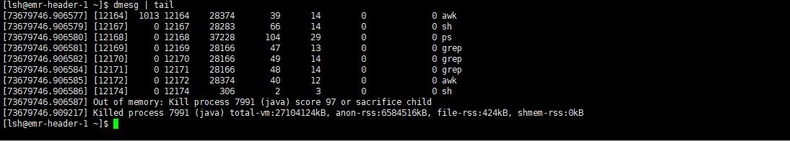

### Dmesg常用命令
    dmesg | more                        # 分页查看
    dmesg | less
    dmesg | tail -10                    # 查看末尾10条记录
    dmesg | head -10                    # 查看前10条记录
    dmesg | grep sda                    # 查找sda相关
    tail -f /var/log/dmesg              # 实时监控dmesg日志输出
  
    
    
    