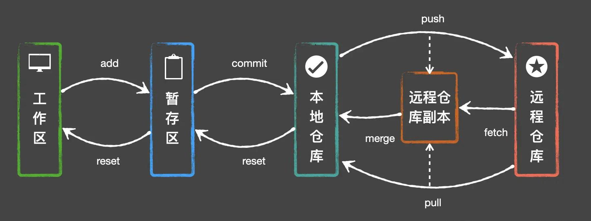

### Git常用命令
  
##### tag管理
    git tag -a tagName -m "XXX"                     创建tag
    git push --tags                                 推送tag到远程   
    git tag -l                                      查看本地tag
    git show-ref --tag                              查看远程tag
    git tag -d tagName                              删除tag
    git push origin :refs/tags/tagName              删除远程

    
