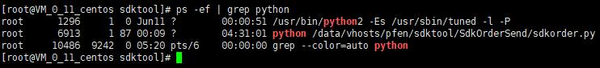
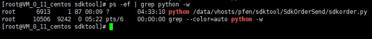

### Grep常用命令
##### 常用选项
    -E ：            开启扩展（Extend）的正则表达式。
    -i ：            忽略大小写（ignore case）。
    -v ：            反过来（invert），只打印没有匹配的，而匹配的反而不打印。
    -n ：            显示行号
    -w ：            被匹配的文本只能是单词，而不能是单词中的某一部分，如文本中有liker，而我搜寻的只是like，就可以使用-w选项来避免匹配liker
    -c ：            显示总共有多少行被匹配到了，而不是显示被匹配到的内容，注意如果同时使用-cv选项是显示有多少行没有被匹配到。
    -o ：            只显示被模式匹配到的字符串。
    --color：        将匹配到的内容以颜色高亮显示。
    -A  n：          显示匹配到的字符串所在的行及其后n行，after
    -B  n：          显示匹配到的字符串所在的行及其前n行，before
    -C  n：          显示匹配到的字符串所在的行及其前后各n行，context
##### -w 参数
    ps -ef | grep python                #显示所有python字符相关的
    ps -ef | grep python -w             #参数 -w ，被匹配的文本只能是单词（如下图区别，python2没有显示）
  
  
##### -r 参数  
    grep -r "test"  /var/log            #在 /var/log目录下 递归查找字符串 "test"
##### -v 参数  
    ls -l | grep "^d"                   #查询目录列表中的 所有目录[文件夹]
    ls -l | grep -v "^d"                #查询目录列表中的 所有文件（-v 除了目前其他都显示，与上相反）
##### 示例
    grep "test"  *.log                  #在当前目录下所有 .log 文件中查找字符串"test"
    grep  -c  "test"  ./log.txt         #查询 log.txt 中 含有 "test" 的行数
    grep  -n  "test"  ./log.txt         #输出含有"test" 的行以及行号
##### 查询特殊字符时，诸如 $  .  ‘  ”  *  [ ]  ^  |  \  +  ?   时，未避免转义，需要在前面加 '\\' 
    grep  "test\.conf"    ./log.txt     #查询含有文件名 test.conf 的行 