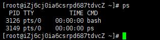
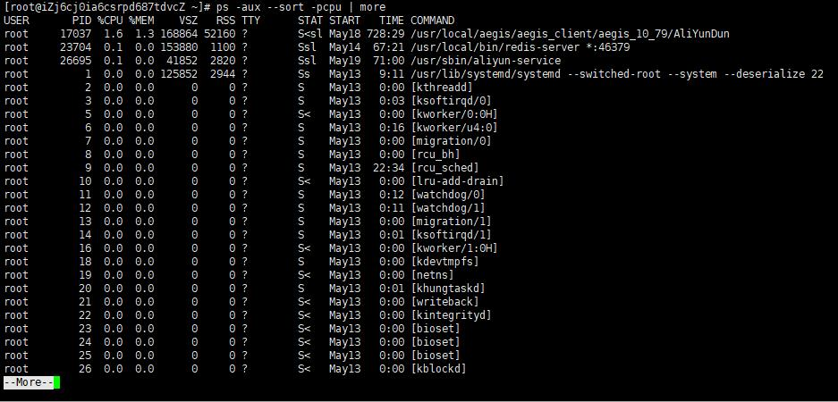
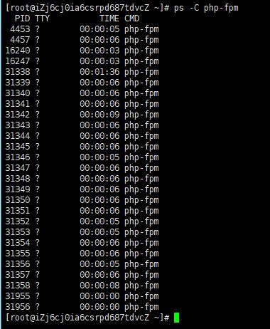
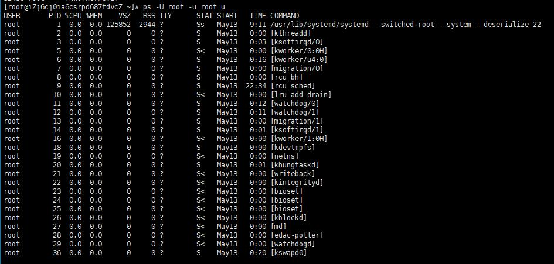
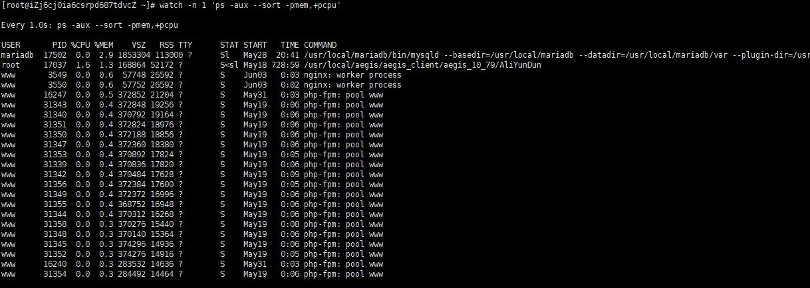

### Ps常用命令
    ps  
    PID: 运行着的命令(CMD)的进程编号    
    TTY: 命令所运行的位置（终端）    
    TIME: 运行着的该命令所占用的CPU处理时间    
    CMD: 该进程所运行的命令
  

    ps -ax                          -a 代表 all，同时加上x参数会显示没有控制终端的进程。
    ps -u www                       -u 代表要查看用户 'www' 的进程
    ps -aux                         通过cpu和内存使用来过滤进程
    ps -aux --sort -pcpu | more     根据 CPU 使用来升序排序
  

    ps -aux --sort -pmem            根据 内存使用 来升序排序
    ps -aux --sort -pcpu,+pmem | head -n 10     我们也可以将它们合并到一个命令，并通过管道显示前10个结果：
    ps -C php-fpm                    通过进程名和PID过滤，-C 参数，后面跟你要找的进程的名字
  

    ps -f -C php-fpm                如果想要看到更多的细节，我们可以使用-f参数来查看格式化的信息列表
    ps -L 31342                     如果我们想知道特定进程的线程， 使用-L 参数，后面加上特定的PID
    ps -axjf                        树形结构显示进程，或者使用：pstree 命令
    ps -U root -u root u            查看由root用户运行的进程和这个进程的其他相关信息时      
    -U 参数按真实用户ID(RUID)筛选进程，它会从用户列表中选择真实用户名或 ID。真实用户即实际创建该进程的用户
    -u 参数用来筛选有效用户ID（EUID）最后的u参数用来决定以针对用户的格式输出，由User, PID, %CPU, %MEM, VSZ, RSS, TTY, STAT, START, TIME 和 COMMAND这几列组成
  
    
    watch -n 1 'ps -aux --sort -pmem,+pcpu'        使用PS实时监控进程状态，每秒刷新一次
      
    