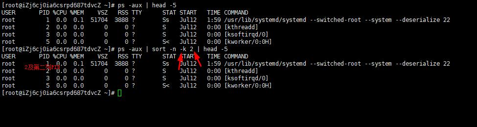
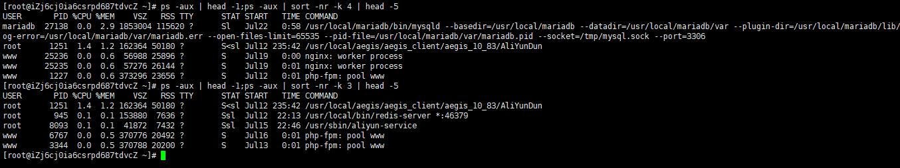
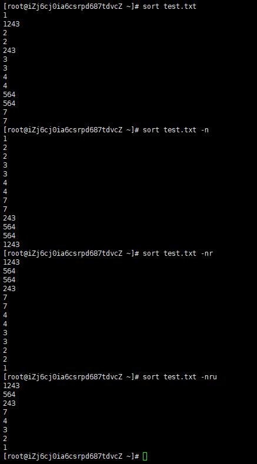

### sort常用命令
    参数：
    -b   忽略每行前面开始出的空格字符
    -c   检查文件是否已经按照顺序排序
    -d   排序时，处理英文字母、数字及空格字符外，忽略其他的字符
    -f   排序时，将小写字母视为大写字母
    -i   排序时，除了040至176之间的ASCII字符外，忽略其他的字符
    -m   将几个排序好的文件进行合并
    -M   将前面3个字母依照月份的缩写进行排序
    -n   依照数值的大小排序
    -o<输出文件>   将排序后的结果存入指定的文件
    -r   以相反的顺序来排序
    -k   按第几列进行排序
    -u   在输出行中去除重复行
    -t<分隔字符>   指定排序时所用的栏位分隔字符
    +<起始栏位>-<结束栏位>   以指定的栏位来排序，范围由起始栏位到结束栏位的前一栏位
    --help   显示帮助
    --version   显示版本信息
    
#### 示例
    ps -aux | sort -nr -k 2 | head -5                         # -n 依照数值的大小排序，-r 相反的顺序排序，-k 表示第二列，及下图 PID 排序
    
    
    ps -aux | head -1;                                        # 用于显示列标题
    ps -aux | head -1;ps -aux | sort -nr -k 4 | head -5       # 查看内存占用最高的前五名，-k 4 及表示 第四列 mem
    ps -aux | head -1;ps -aux | sort -nr -k 3 | head -5       # 查看CPU占用最高的前五名，-k 3 及表示 第三列 cpu
 
    
    sort -n test.txt                                          # 依照数值的大小排序
    sort -nr test.txt                                         # 依照数值的大小以相反的顺序来排序
    sort -nru test.txt                                        # 依照数值的大小以相反的顺序来排序，并在输出行中去除重复行
                             
    
    
    
    
    
    
    
    
    
    
    