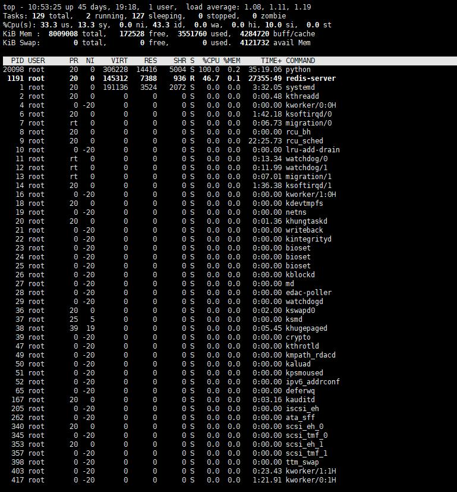

### Top常用命令
    top
    M                                   # 根据驻留内存大小进行排序，常用
    P                                   # 根据CPU使用百分比大小进行排序，常用
    s                                   # 设置刷新时间，常用
    f                                   # 进入字段显示配置模式，可增加或者移除显示字段，按相应的字母新增或去除；o:进入字段顺序设置模式，可配置显示位置顺序，按相应的字母往下移动，按“shift+相应的字母”往上移动，常用
    u                                   # 输入用户，显示用户的任务
    i                                   # 忽略闲置和僵死进程。这是一个开关式命令。
    R                                   # 正常排序/反向排序
    H                                   # 显示线程
    1                                   # 监控每个逻辑CPU的状况
    Z                                   # 改变颜色
    B                                   # 加粗
    t                                   # 显示和隐藏任务/cpu信息
    m                                   # 显示和隐藏内存信息
    d                                   # 指定每两次屏幕信息刷新之间的时间间隔
    top -p PID                          # 通过指定监控进程ID来仅仅监控某个进程的状态
    top -H -p pid                       # 显示某个进程所有活跃的线程消耗情况   
  
### 详解
    第一行：系统运行时间和平均负载，当前时间、系统已运行时间、当前登录用户的数量、最近5、10、15分钟内的平均负载
    第二行：任务，任务的总数、运行中(running)的任务、休眠(sleeping)中的任务、停止(stopped)的任务、僵尸状态(zombie)的任务
    第三行：cpu状态，
    us->user： 运行(未调整优先级的) 用户进程的CPU时间，
    sy->system: 运行内核进程的CPU时间，
    ni->niced：运行已调整优先级的用户进程的CPU时间，
    id->idle:空闲时间，
    wa->IO wait: 用于等待IO完成的CPU时间，
    hi->处理硬件中断的CPU时间，
    si->处理软件中断的CPU时间，
    st->这个虚拟机被hypervisor偷去的CPU时间（译注：如果当前处于一个hypervisor下的vm，实际上hypervisor也是要消耗一部分CPU处理时间的）
    
    第四行：内存，全部可用内存、已使用内存、空闲内存、缓冲内存
    第五行：swap，全部、已使用、空闲和缓冲交换空间
    第七行至N行：各进程任务的的状态监控
    PID     进程ID，进程的唯一标识符
    USER    进程所有者的实际用户名
    PR      进程的调度优先级。这个字段的一些值是'rt'。这意味这这些进程运行在实时态。
    NI      进程的nice值（优先级）。越小的值意味着越高的优先级。负值表示高优先级，正值表示低优先级
    VIRT    virtual memory usage 虚拟内存,进程使用的虚拟内存。进程使用的虚拟内存总量，单位kb。VIRT=SWAP+RES
            1、进程“需要的”虚拟内存大小，包括进程使用的库、代码、数据等
            2、假如进程申请100m的内存，但实际只使用了10m，那么它会增长100m，而不是实际的使用量
    
    RES     resident memory usage 常驻内存,驻留内存大小。驻留内存是任务使用的非交换物理内存大小。进程使用的、未被换出的物理内存大小，单位kb。RES=CODE+DATA
            1、进程当前使用的内存大小，但不包括swap out
            2、包含其他进程的共享
            3、如果申请100m的内存，实际使用10m，它只增长10m，与VIRT相反
            4、关于库占用内存的情况，它只统计加载的库文件所占内存大小
    
    SHR     shared memory 共享内存
            1、除了自身进程的共享内存，也包括其他进程的共享内存
            2、虽然进程只使用了几个共享库的函数，但它包含了整个共享库的大小
            3、计算某个进程所占的物理内存大小公式：RES – SHR
            4、swap out后，它将会降下来
    
    S       这个是进程的状态。它有以下不同的值:
            D - 不可中断的睡眠态。
            R – 运行态
            S – 睡眠态
            T – 被跟踪或已停止
            Z – 僵尸态
            
    %CPU    自从上一次更新时到现在任务所使用的CPU时间百分比。%CPU显示的是进程占用一个核的百分比，而不是整个cpu（N核）的百分比，有时候可能大于100，那是因为该进程启用了多线程占用了多个核心，所以有时候我们看该值得时候会超过100%，但不会超过总核数*100
    %MEM    进程使用的可用物理内存百分比
    TIME+   任务启动后到现在所使用的全部CPU时间，精确到百分之一秒
    COMMAND 运行进程所使用的命令。进程名称（命令名/命令行）
    

    
    
    